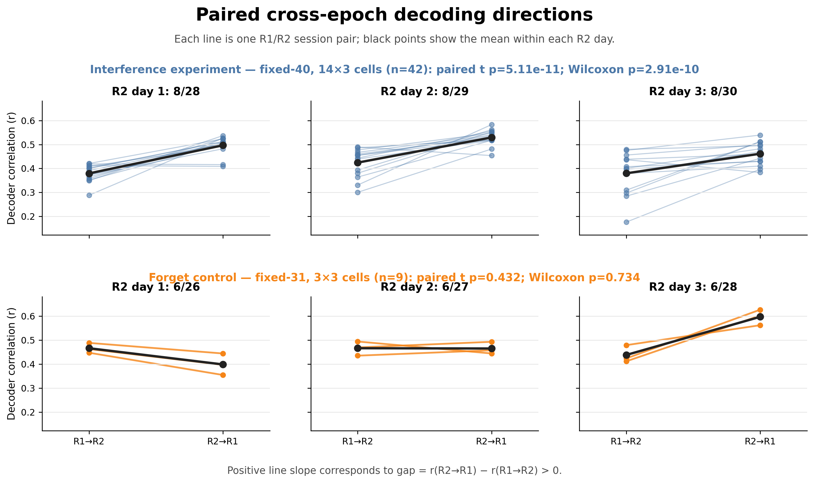
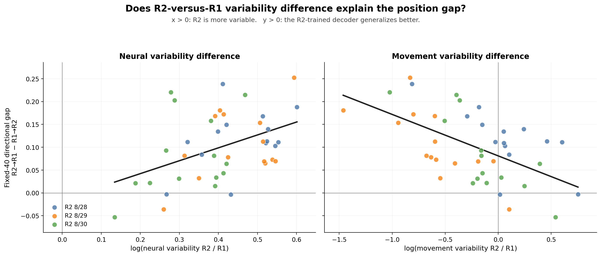
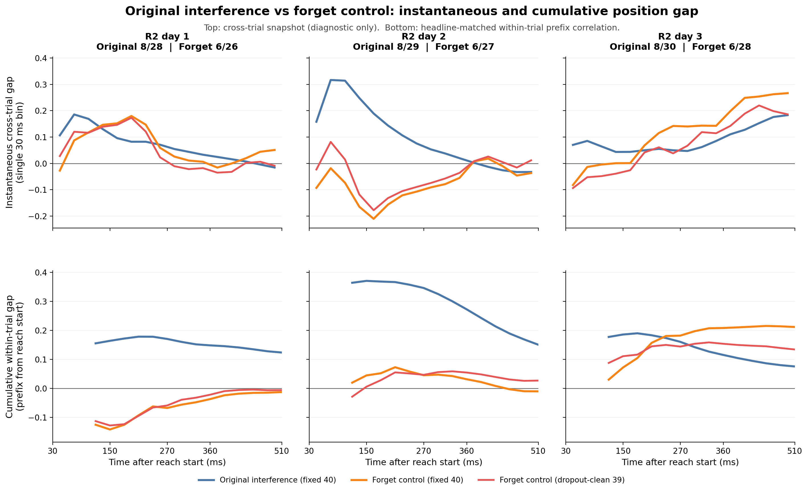

# Position-Decoding Asymmetry After Variability Matching

**Animals:** TS primary analysis; TY interference replication

## Question

Does the directional position-decoding asymmetry remain after neural
trial-to-trial variability is matched between each R1/R2 session pair?

The directional contrast was defined as

\[
\Delta = r_{R2\rightarrow R1} - r_{R1\rightarrow R2}.
\]

The original prespecified directional alternative was \(\Delta>0\). The
symmetry checks in this report now use both a **two-sided paired t-test** and a
**two-sided Wilcoxon signed-rank test** across paired R1/R2 cells. The sign of
the estimated gap is then used to describe the direction of any asymmetry.

## Neural Variability Matching

The analysis included all 14 R1 sessions and 3 R2 sessions, giving 42
R1-by-R2 session pairs. For each session, neural trial-to-trial variability
was represented by the distribution of mean squared distances between every
unique pair of phase-normalized population trajectories.

This primary analysis matched **neural variability only**. Kinematic or
position variability was not used to select trials for the Directional
Significance table below; kinematics entered that analysis only as the decoder
target.

For the primary matching direction, the R1 session was held fixed and trials
were removed only from the paired R2 session. The target interval was the
exact R1 session's neural pair-variability mean plus or minus one standard
deviation. If the current R2 mean was above the interval, the trial with the
largest current contribution to pair variability was removed. If it was below
the interval, the trial with the smallest contribution was removed. Pair
variability was recomputed after every removal, and trimming stopped at the
first entry into the R1 interval.

All 42 R2 subsets entered their corresponding R1 mean ± 1 SD interval. The
median retained R2 trial count was 49, with a range of 25–92 trials. A distinct
R2 subset was selected for every R1/R2 session pair.

## Locked Decoder

Only the locked position-decoding configuration was tested:

| Component | Locked value |
|---|---|
| Neural bin size | 30 ms |
| Kinematic smoother | second-order zero-phase Butterworth |
| Neural lag | 0 ms |
| Neural dimensions | 12 PCs |
| Cross-day alignment | trial-average CCA |
| Decoder | Kalman |
| Target | relative position |

PCA, CCA, and Kalman parameters were refit using the actual selected trial
subset for each session pair. Both transfer directions were evaluated on the
same pair-specific subset.

### Unresolved 30-Phase-Bin Caveat

Both the variability-matching features and the CCA alignment resample each
variable-length reach onto 30 normalized phase bins. At the locked 30-ms time
resolution, a typical reach contains only about 20 original samples, so this
step mildly upsamples the trial by roughly 1.5-fold. This was previously
flagged as a possible interpolation/alignment artifact, and the requested
phase-grid sensitivity analysis has not yet been completed. The matched TS
result and the complete forget-control result are therefore conditional on
the 30-phase-bin representation and should be rerun with non-upsampling grids,
such as 10, 15, and 20 bins.

## Directional Significance

For the requested two-sided symmetry check, the hypotheses were

\[
H_0: \mu_{\Delta}=0,
\qquad
H_1: \mu_{\Delta}\neq 0.
\]

| Condition | R1→R2 | R2→R1 | Mean gap | Paired t p (two-sided) | Wilcoxon p (two-sided) | Two-sided 95% CI |
|---|---:|---:|---:|---:|---:|---:|
| Original full-trial data | 0.3788 | 0.4761 | 0.09728 | **5.38 × 10⁻⁴** | **5.27 × 10⁻⁴** | [0.04497, 0.14959] |
| Neural-variability matched | 0.4073 | 0.5041 | 0.09684 | **8.27 × 10⁻⁶** | **6.97 × 10⁻⁶** | [0.05845, 0.13522] |

The paired t-test asks whether the mean of the 42 cell gaps differs from zero;
the Wilcoxon test asks whether the signed ranks are centered on zero without
requiring normally distributed gaps. Both tests detect the same positive
position-decoding asymmetry before and after neural variability matching.

These are **cell-level** tests of the two mirrored heatmap blocks. The 42 cells
are paired correctly by R1/R2 date, but they are not 42 independent biological
replicates because cells share 14 R1 dates and only 3 R2 dates. Session-level
aggregation and crossed-session bootstrap results should therefore remain the
primary evidence for stability across dates.

The gap changed by only

\[
0.09684-0.09728=-0.00044.
\]

A one-tailed paired test for the predicted reduction in gap gave \(p=0.493\),
and the corresponding two-sided change test gave \(p=0.986\). Thus, neural
variability matching produced no detectable reduction in the position gap.

## Pair-Specific Kinematic Variability Matching

The exact pair-specific procedure was also rerun using `position_pair_msd`
rather than `neural_pair_msd` to select trials. Position bands of mean ± 1,
2, and 3 SD were evaluated separately. This is a kinematic-only sensitivity
analysis: neural variability was not constrained, and trial counts were not
equalized.

For the primary direction, each complete R1 session defined its own position
pair-MSD band and only its paired R2 session could be trimmed. All 42 R2
subsets were within their corresponding bands. At 1 SD, 41/42 R2 subsets were
already inside and the remaining cell required removal of only one trial. At
2 and 3 SD, all 42 complete R2 subsets were already inside, so no R2 trial was
removed and the decoded result was exactly the original full-trial result.

| Position band | R2 cells unchanged | R1 cells unchanged | R1→R2 | R2→R1 | Mean gap | Paired t p (two-sided) | Wilcoxon p (two-sided) | Two-sided 95% CI |
|---|---:|---:|---:|---:|---:|---:|---:|---:|
| ±1 SD | 41/42 | 39/42 | 0.3772 | 0.4763 | 0.09906 | **4.44 × 10⁻⁴** | **4.74 × 10⁻⁴** | [0.04670, 0.15143] |
| ±2 SD | 42/42 | 41/42 | 0.3788 | 0.4761 | 0.09728 | **5.38 × 10⁻⁴** | **5.27 × 10⁻⁴** | [0.04497, 0.14959] |
| ±3 SD | 42/42 | 42/42 | 0.3788 | 0.4761 | 0.09728 | **5.38 × 10⁻⁴** | **5.27 × 10⁻⁴** | [0.04497, 0.14959] |


## Within-Day Decoding Control

An absolute directional gap could be biased if R1 and R2 differed in their
within-day decoding ceilings. Under the same locked configuration, mean
within-day position decoding was 0.7036 for R1 and 0.6983 for R2. Their mean
difference was only 0.0053 and was not significant (two-sided \(p=0.510\)).

After subtracting this within-day test-ceiling difference from each raw
directional contrast, the mean adjusted gap remained 0.0920 and significant
(one-tailed \(p=0.000940\)). The TS position asymmetry is therefore not
explained by R1 being intrinsically easier to decode than R2.

## Random Fixed-40 Trial-Count Control

As an equal-count sensitivity analysis, every one of the 42 TS
R1-by-R2 interference cells was randomly restricted to 40 R1 and 40 R2 trials.
Fifty independent subset repeats were run for both position and velocity, with
PCA, CCA, and Kalman parameters refit inside every repeat. Unlike the separate
variability-matched fixed-40 analysis, these subsets were selected randomly and
were constrained only by trial count.

| Target | Full-data gap | Random-40 R1→R2 | Random-40 R2→R1 | Random-40 mean gap | Repeat 2.5%–97.5% | Positive repeats |
|---|---:|---:|---:|---:|---:|---:|
| Position | +0.0973 | 0.3945 | 0.4959 | +0.1014 | [+0.0599, +0.1420] | 50/50 |
| Velocity | +0.0907 | 0.2441 | 0.3057 | +0.0616 | [+0.0390, +0.0857] | 50/50 |

The position gap was fully retained after exact equal-count subsampling. The
velocity gap retained about 68% of its full-data magnitude, indicating greater
subset-size sensitivity, but it remained positive in every repeat.

The repeats measure Monte Carlo subset sensitivity and are not independent
biological replicates. For session-level inference, scores were first averaged
across repeats within each R1/R2 cell:

| Target | R1-session p (n=14) | R2-session p (n=3) | Crossed-session bootstrap 95% CI |
|---|---:|---:|---:|
| Position | **6.2 × 10⁻⁵** | **0.00517** | [+0.0603, +0.1401] |
| Velocity | **9.5 × 10⁻⁵** | **0.0348** | [+0.0231, +0.0951] |

Thus, unequal trial counts do not explain the TS interference position gap.
They contribute to the magnitude of the velocity result, but do not account
for its positive direction under this fixed-40 control.

### Paired Directions in the Mirrored Heatmap Regions



The upper-right and lower-left regions of each cross-epoch heatmap contain the
same R1/R2 date combinations in opposite decoder directions. After transposing
one region, each line above joins the two scores for exactly the same session
pair. The interference experiment supplies 14 pairs within each of three R2
dates (42 lines total). The complete current forget control supplies three R1
pairs within each of three R2 dates (9 lines total).

| Condition | Grid | R1→R2 | R2→R1 | Mean gap | Positive pairs | Paired t p (two-sided) | Wilcoxon p (two-sided) |
|---|---:|---:|---:|---:|---:|---:|---:|
| Interference, random fixed-40 | 14×3 | 0.3945 | 0.4959 | +0.1014 | 38/42 | **5.11 × 10⁻¹¹** | **2.91 × 10⁻¹⁰** |
| Forget, random fixed-31 | 3×3 | 0.4572 | 0.4872 | +0.0301 | 5/9 | 0.432 | 0.734 |

Most interference lines rise from R1→R2 to R2→R1, so both two-sided paired
tests reject cell-level symmetry. The nine forget lines are heterogeneous and
neither paired test rejects symmetry. These cell-level tests still share dates,
so the crossed-session result below is the more appropriate uncertainty check.

The very small interference cell-level p-values must not be interpreted as 42
independent-date replicates, because the cells share sessions. They visualize
and test the two mirrored blocks directly; the R1-date, R2-date, and crossed
inference above addresses the dependence structure.

### Direct Interference-Minus-Forget Contrast

Comparing one condition's significant p-value with another condition's
nonsignificant p-value is not itself a test that the conditions differ. The
direct fixed-40 contrast was therefore calculated as

\[
\Delta_{\mathrm{interference}}-\Delta_{\mathrm{forget}}.
\]

The observed difference was +0.0713. A crossed bootstrap independently
resampled R1 and R2 dates within both the 14-by-3 interference grid and the
complete 3-by-3 forget grid. The 95% interval was [-0.0596, +0.1794], with a
two-sided bootstrap \(p=0.278\). Thus, the point estimate is in the predicted
direction, but the current date-level uncertainty does not establish that the
interference gap is larger than the forget gap. The comparison uses fixed-40
interference cells and fixed-31 forget cells because 31 is the largest common
count in the complete forget grid.

### Variability Difference Versus Directional Gap



For each of the 42 R1/R2 session pairs, the horizontal axis is the signed
variability difference \(\log(V_{R2}/V_{R1})\), and the vertical axis is the
random fixed-40 position gap
\(r_{R2\rightarrow R1}-r_{R1\rightarrow R2}\). Thus, positive horizontal
values mean R2 is more variable, while positive vertical values mean that the
R2-trained decoder generalizes better.

Neural variability showed a positive descriptive slope (+0.282), but its
crossed-session bootstrap 95% interval included zero [-0.119, +0.525]. The
movement-variability relationship was negative: slope -0.091, crossed-session
95% interval [-0.186, -0.027], with Spearman \(\rho=-0.53\). The movement
slope was negative within each of the three R2 dates. These results do not
support the hypothesis that greater R2 movement variability produces a larger
positive directional gap. They remain associative rather than causal because
variability was estimated from the complete sessions, whereas decoding used
random fixed-40 subsets.

## TY Interference Replication Update

TY currently contributes 11 R1 dates and all three R2 dates. The three locked
position gaps are heterogeneous:

| TY R2 date | R1→R2 | R2→R1 | Gap |
|---|---:|---:|---:|
| 2025-03-04 | 0.2624 | 0.3833 | +0.1208 |
| 2025-03-05 | 0.3845 | 0.3267 | -0.0578 |
| 2025-03-06 | -0.0078 | 0.4847 | +0.4925 |

The 33-cell mean gap is +0.1852. Aggregation over the 11 R1 dates is positive
(one-sided \(p=4.63\times10^{-5}\)), but aggregation over only three
independent R2 dates is not significant (one-sided \(p=0.186\)). The crossed
session bootstrap 95% interval is [-0.0565, +0.4824]. TY therefore supports a
consistent R1-date pattern, but not yet stability across R2 dates; in
particular, 2025-03-05 does not reproduce the positive directional asymmetry.

## Forget-Control Update: Complete Three-by-Three Grid

The forget control repeats Task A after a comparable long interval without an
intervening Task B. All three R1 dates (2026-06-09 through 2026-06-11) and all
three R2 dates (2026-06-26 through 2026-06-28) are now processed, providing the
planned three-by-three grid.

The analysis uses the `forget` reaching trials and their right-arm kinematics.
The `forgetFree` streams are not used because their processed trial segments
and usable wrist/shoulder kinematics are unavailable.

### Available Trials and Equal-N Results

The decoder-usable S/F counts are 40, 31, and 93 for the three R1 dates and
76, 81, and 93 for the three R2 dates. The complete grid is therefore matched
at 31 trials per day. Fifty random subsets were evaluated for each of the nine
cells, with PCA, CCA, and Kalman refit inside every repeat. The dropout-clean
analysis also retains a 31-trial common minimum.

| Position analysis | R1→R2 | R2→R1 | Mean gap | Crossed-session 95% interval |
|---|---:|---:|---:|---:|
| Fixed-31 | 0.4572 | 0.4872 | +0.0301 | [-0.0677, +0.1551] |
| Dropout-clean fixed-31 | 0.4771 | 0.4836 | +0.0065 | [-0.0711, +0.0923] |

| R2 date | Fixed-31 position gap | Dropout-clean fixed-31 gap |
|---|---:|---:|
| 2026-06-26 | -0.0677 | -0.0683 |
| 2026-06-27 | -0.0012 | -0.0049 |
| 2026-06-28 | +0.1592 | +0.0928 |

Velocity is similarly near symmetric: fixed-31 gap +0.0082 and
dropout-clean fixed-31 gap +0.0064, with both crossed-session intervals
including zero. R2 day 3 remains the most positive date, but averaging over
all three R1 dates substantially reduces the earlier one-by-three estimate.
The completed current control therefore provides no stable evidence of a
positive directional gap. The 50 repeats quantify trial-selection
sensitivity, not independent biological replication.

### Within-Reach Timing



This timing diagnostic predates the complete grid and uses forget R1
2026-06-09 against the three R2 dates; it should not be read as a 3-by-3
average. The upper row is an instantaneous diagnostic: at each 30 ms bin, correlation
is calculated across test trials. These pointwise values are not additive and
their running average is not the headline gap. The lower row uses the correct
headline-matched estimator: temporal correlation is computed within each
trial over progressively longer prefixes from reach start. Its full-reach
endpoint exactly reproduces the saved decoder gap.

For a direct fixed-40 comparison, the cumulative gaps are:

| Condition and R2 date | Through 150 ms | Through 360 ms | Through 510 ms | Full reach |
|---|---:|---:|---:|---:|
| Original interference 2025-08-28 | +0.1637 | +0.1480 | +0.1234 | +0.1100 |
| Original interference 2025-08-29 | +0.3702 | +0.2721 | +0.1503 | +0.1137 |
| Original interference 2025-08-30 | +0.1854 | +0.1150 | +0.0754 | +0.0820 |
| Forget 2026-06-26 | -0.1417 | -0.0371 | -0.0130 | +0.0277 |
| Forget 2026-06-27 | +0.0445 | +0.0312 | -0.0104 | -0.0146 |
| Forget 2026-06-28 | +0.0718 | +0.2079 | +0.2113 | +0.2291 |

The original interference gap is already strongest at the beginning of the
reach and is diluted as later samples are included. The 2026-06-28 forget gap
has a different time course: it is modestly positive by 150 ms and becomes
large by 360 ms. The two experiments therefore do not currently support one
shared within-reach accumulation mechanism, despite both showing a positive
R2 day-3 value.

## Reproducibility

Maintained analyses write complete outputs to `Results/workflows/`. The
report-facing snapshot is refreshed through the explicit publication map:

```bash
python Code/generalization/run_analysis.py publish-results
python Code/generalization/run_analysis.py publish-check
```


### Original TS Variability-Matching Analysis

- [Pair-specific matching](../../Code/generalization/analyses/pairwise_bidirectional_neural_variability_band_match.py)
- [Matched decoding](../../Code/generalization/analyses/decode_pairwise_neural_variability_band.py)
- [Significance analysis](../../Code/generalization/analyses/position_asymmetry_significance.py)
- [Statistical results](../../Results/current/interference/neural_variability_matching/tables/position_asymmetry_significance_matched_TS.csv)
- [Pair-level results](../../Results/current/interference/neural_variability_matching/tables/position_asymmetry_significance_pairs_TS.csv)
- [Summary figure](../../Results/current/interference/neural_variability_matching/figures/fig_position_asymmetry_significance.png)

### Separate Equal-N Neural-plus-Position Follow-up

- [Equal-N subset selection](../../Code/generalization/analyses/match_all_trial_pair_variability.py)
- [Equal-N matched decoding](../../Code/generalization/analyses/decode_variability_matched_crossday.py)
- [Fixed-40 selection summary](../../Results/current/interference/neural_variability_matching/tables/variability_match_all42_fixed40_tol10_summary.csv)
- [Fixed-40 selected trials](../../Results/current/interference/neural_variability_matching/tables/variability_match_all42_fixed40_tol10_trials.csv)
- [Fixed-40 decoding results](../../Results/current/interference/neural_variability_matching/tables/variability_matched_crossday_fixed40.csv)

### Random Fixed-40 Trial-Count Control

- [Random-subset implementation](../../Code/generalization/analyses/random_fixed40_crossday_control.py)
- [Position repeat summary](../../Results/current/interference/trial_count_control/tables/random_fixed40_position_summary.csv)
- [Position cell means](../../Results/current/interference/trial_count_control/tables/random_fixed40_position_cells.csv)
- [Position session inference](../../Results/current/interference/trial_count_control/tables/random_fixed40_position_inference.csv)
- [Position figure](../../Results/current/interference/trial_count_control/figures/fig_random_fixed40_position_control.png)
- [Velocity repeat summary](../../Results/current/interference/trial_count_control/tables/random_fixed40_velocity_summary.csv)
- [Velocity cell means](../../Results/current/interference/trial_count_control/tables/random_fixed40_velocity_cells.csv)
- [Velocity session inference](../../Results/current/interference/trial_count_control/tables/random_fixed40_velocity_inference.csv)
- [Velocity figure](../../Results/current/interference/trial_count_control/figures/fig_random_fixed40_velocity_control.png)
- [Variability-difference plotting and statistics](../../Code/generalization/analyses/plot_variability_difference_vs_gap.py)
- [Variability-difference pair data](../../Results/current/interference/variability_gap_association/tables/variability_difference_vs_fixed40_gap.csv)
- [Variability-difference statistics](../../Results/current/interference/variability_gap_association/tables/variability_difference_vs_fixed40_gap_stats.csv)
- [Variability-difference figure](../../Results/current/interference/variability_gap_association/figures/fig_variability_difference_vs_fixed40_gap.png)
- [Paired-direction plotting and statistics](../../Code/generalization/analyses/plot_interference_forget_paired_directional.py)
- [Paired equal-N cell data](../../Results/current/comparisons/interference_vs_forget/tables/paired_directional_cells.csv)
- [Two-sided paired tests](../../Results/current/comparisons/interference_vs_forget/tables/paired_directional_tests.csv)
- [Direct condition contrast](../../Results/current/comparisons/interference_vs_forget/tables/directional_gap_contrast.csv)
- [Paired-direction figure](../../Results/current/comparisons/interference_vs_forget/figures/paired_directional.png)

### Pair-Specific Position-Variability Follow-up

The pair-specific matching and decoder scripts now accept `--metric position`,
`--match-metric position`, and `--band-sd 1|2|3`; their defaults remain
`neural` and 1 SD so the original analysis is unchanged.

- [Pair-specific matching implementation](../../Code/generalization/analyses/pairwise_bidirectional_neural_variability_band_match.py)
- [Matched decoding implementation](../../Code/generalization/analyses/decode_pairwise_neural_variability_band.py)
- [Significance implementation](../../Code/generalization/analyses/position_asymmetry_significance.py)
- [Selection summary](../../Results/current/interference/kinematic_variability_matching/tables/pairwise_bidirectional_position_variability_band_match_TS_summary.csv)
- [Selected trials](../../Results/current/interference/kinematic_variability_matching/tables/pairwise_bidirectional_position_variability_band_match_TS_trials.csv)
- [Position-decoding results](../../Results/current/interference/kinematic_variability_matching/tables/pairwise_position_variability_band_decoding_TS_position.csv)
- [Statistical results](../../Results/current/interference/kinematic_variability_matching/tables/position_asymmetry_significance_position_matched_TS.csv)
- [Pair-level gaps](../../Results/current/interference/kinematic_variability_matching/tables/position_asymmetry_significance_position_matched_pairs_TS.csv)
- [Summary figure](../../Results/current/interference/kinematic_variability_matching/figures/fig_position_asymmetry_significance_position_matched.png)
- [2-SD selection summary](../../Results/current/interference/kinematic_variability_matching/tables/pairwise_bidirectional_position_variability_band_sd2_match_TS_summary.csv)
- [2-SD decoding results](../../Results/current/interference/kinematic_variability_matching/tables/pairwise_position_variability_band_sd2_decoding_TS_position.csv)
- [2-SD statistical results](../../Results/current/interference/kinematic_variability_matching/tables/position_asymmetry_significance_position_sd2_matched_TS.csv)
- [3-SD selection summary](../../Results/current/interference/kinematic_variability_matching/tables/pairwise_bidirectional_position_variability_band_sd3_match_TS_summary.csv)
- [3-SD decoding results](../../Results/current/interference/kinematic_variability_matching/tables/pairwise_position_variability_band_sd3_decoding_TS_position.csv)
- [3-SD statistical results](../../Results/current/interference/kinematic_variability_matching/tables/position_asymmetry_significance_position_sd3_matched_TS.csv)

### Forget-Control Analysis and Within-Reach Timing

- [Equal-N forget-control driver](../../Code/generalization/analyses/forget_control_equal_n_crossday.py)
- [Fixed-31 position cell results](../../Results/current/forget_control/equal_n_3x3/tables/forget_control_fixed31_position_cells.csv)
- [Fixed-31 position inference](../../Results/current/forget_control/equal_n_3x3/tables/forget_control_fixed31_position_inference.csv)
- [Dropout-clean fixed-31 position cells](../../Results/current/forget_control/equal_n_3x3/tables/forget_control_dropout_clean_fixed31_position_cells.csv)
- [Dropout-clean fixed-31 position inference](../../Results/current/forget_control/equal_n_3x3/tables/forget_control_dropout_clean_fixed31_position_inference.csv)
- [Cumulative headline-gap implementation](../../Code/generalization/analyses/cumulative_m2_timecourse.py)
- [Forget cumulative analysis](../../Code/generalization/analyses/forget_control_position_cumulative_m2.py)
- [Original-interference cumulative analysis](../../Code/generalization/analyses/interference_position_cumulative_m2_random_fixed40.py)
- [Instantaneous forget analysis](../../Code/generalization/analyses/forget_control_position_time_resolved.py)
- [Instantaneous original-interference analysis](../../Code/generalization/analyses/interference_position_time_resolved_random_fixed40.py)
- [Combined plotting script](../../Code/generalization/analyses/plot_interference_forget_instantaneous_and_cumulative.py)
- [Cumulative checkpoint values](../../Results/current/comparisons/interference_vs_forget/time_resolved/tables/forget_control_position_cumulative_m2_checkpoints.csv)
- [Combined figure](../../Results/current/comparisons/interference_vs_forget/time_resolved/figures/fig_interference_vs_forget_instantaneous_and_cumulative.png)

### TY Replication

- [Locked TY cell gaps](../../Results/current/cross_animal/ty_locked_position/tables/locked_position_asymmetry_pairs_ty.csv)
- [R2-date summaries](../../Results/current/cross_animal/ty_locked_position/tables/locked_position_asymmetry_by_r2_ty.csv)
- [Date-aware significance](../../Results/current/cross_animal/ty_locked_position/tables/locked_position_asymmetry_significance_ty.csv)
- [TY paired-direction script](../../Code/generalization/analyses/plot_ty_paired_directional_significance.py)
